# Font Previews

These previews were generated with the same renderer that `panda_esl.write` uses for `dry_run: true`, so they show exactly the pixels that reach the label. Two canvases are shown for every font:

| Column | Label | Canvas | `PANDA` size | `ABC 123` size |
| --- | --- | --- | --- | --- |
| 2.13" | ETAG-525 | 256x128 | 48 | 32 |
| 2.66" | ETAG-526 | 296x152 | 56 | 40 |

Pixel fonts are rendered at the nearest whole multiple of their native grid instead of the sizes above (see [Pixel fonts](#pixel-fonts)). The exact size used for each image is listed in [sizes.json](../images/font-previews/sizes.json).

Text on PANDA labels is drawn in 1-bit mode: every pixel is either black or white, there is no anti-aliasing. That is why diagonal and curved strokes show stair-steps. The only ways to reduce the effect are to use a font with good hinting for monochrome rendering, or to use a font that was drawn on a pixel grid and render it at a multiple of that grid.

Optional fonts are available in [optional_fonts](../optional_fonts/). Copy any optional `.ttf` file you want to use into `config/panda_esl/fonts/`, then reference the file name in a payload. To regenerate this gallery run `python tools/generate_font_previews.py` from the repository root.

## Bundled and Korean fonts

Noto Sans KR Regular and Bold ship with the integration. The rest are optional downloads. All of these fonts cover Hangul.

| Font | File | 2.13" (256x128) | 2.66" (296x152) |
| --- | --- | --- | --- |
| Noto Sans KR Thin | `NotoSansKR-Thin.ttf` |  | 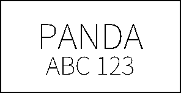 |
| Noto Sans KR ExtraLight | `NotoSansKR-ExtraLight.ttf` |  | 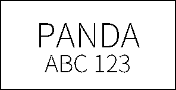 |
| Noto Sans KR Light | `NotoSansKR-Light.ttf` |  |  |
| Noto Sans KR Regular | `fonts/NotoSansKR-Regular.ttf` |  | 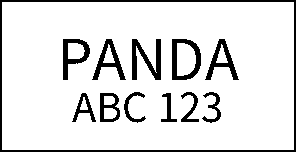 |
| Noto Sans KR Medium | `NotoSansKR-Medium.ttf` |  | 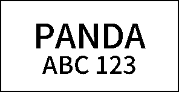 |
| Noto Sans KR SemiBold | `NotoSansKR-SemiBold.ttf` |  | 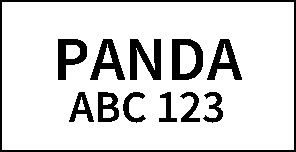 |
| Noto Sans KR Bold | `fonts/NotoSansKR-Bold.ttf` |  | 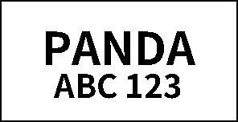 |
| Noto Sans KR ExtraBold | `NotoSansKR-ExtraBold.ttf` |  | 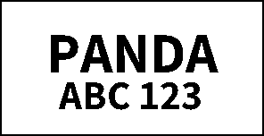 |
| Noto Sans KR Black | `NotoSansKR-Black.ttf` |  |  |
| Gmarket Sans Light | `GmarketSansTTFLight.ttf` |  | 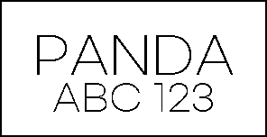 |
| Gmarket Sans Medium | `GmarketSansTTFMedium.ttf` |  |  |
| Gmarket Sans Bold | `GmarketSansTTFBold.ttf` |  |  |
| CookieRun Regular | `CookieRunRegular.ttf` |  | 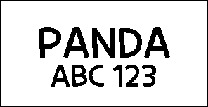 |
| CookieRun Bold | `CookieRunBold.ttf` |  | 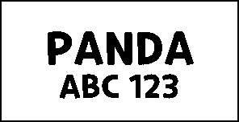 |
| CookieRun Black | `CookieRunBlack.ttf` |  |  |
| Ownglyph Park DaHyun | `OwnglyphParkDaHyun.ttf` |  | 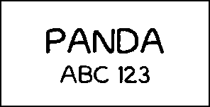 |

## Fonts for small monochrome screens

The fonts below were picked because they are known to hold up on low-resolution, black-and-white displays. They fall into two groups:

- **Screen-hinted outline fonts.** Regular vector fonts that were designed for screens and carry TrueType hinting instructions. In 1-bit mode FreeType runs those instructions, which snap stems to whole pixels and keep stroke widths even. They are the safest choice for general text and they cover a wide range of characters.
- **Pixel fonts.** Fonts that were drawn pixel by pixel on a fixed grid and later converted to outlines. Rendered at a whole multiple of that grid they produce no aliasing at all, because every outline edge lands on a pixel boundary. Rendered at any other size they look worse than an ordinary font.

None of these fonts cover Hangul except Galmuri, which is a Korean pixel font. If you need Korean text with a clean pixel look, use Galmuri; otherwise keep using Noto Sans KR.

### Screen-hinted outline fonts

| Font | File | Why it is here | 2.13" (256x128) | 2.66" (296x152) |
| --- | --- | --- | --- | --- |
| Atkinson Hyperlegible Regular | `AtkinsonHyperlegible-Regular.ttf` | Designed by the Braille Institute for low-vision readers. Unambiguous letterforms (`I`/`l`/`1`, `0`/`O`) and open shapes that survive coarse pixels. | 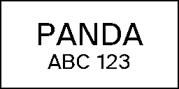 | 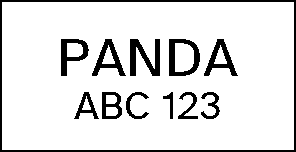 |
| Atkinson Hyperlegible Bold | `AtkinsonHyperlegible-Bold.ttf` | Bold weight of the above. |  | 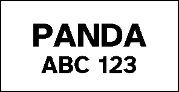 |
| B612 Regular | `B612-Regular.ttf` | Commissioned by Airbus for cockpit screens. Optimised for legibility on low-resolution displays at a distance. | 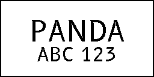 | 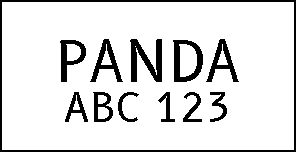 |
| B612 Bold | `B612-Bold.ttf` | Bold weight of the above. |  | 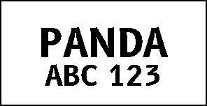 |
| DejaVu Sans | `DejaVuSans.ttf` | Derived from Bitstream Vera, which was hand-hinted for screen rendering. The default sans on most Linux desktops. | 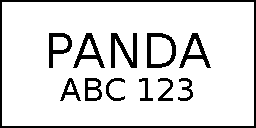 | 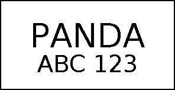 |
| DejaVu Sans Bold | `DejaVuSans-Bold.ttf` | Bold weight of the above. |  | 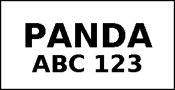 |
| Liberation Sans Regular | `LiberationSans-Regular.ttf` | Metric-compatible Arial replacement with full TrueType hinting. Narrower than DejaVu, so more text fits per line. | 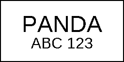 | 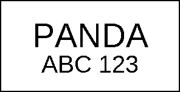 |
| Liberation Sans Bold | `LiberationSans-Bold.ttf` | Bold weight of the above. |  | 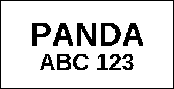 |

### Pixel fonts

The **Grid** column is the pixel size the font was drawn on. Use `size` values that are whole multiples of it (for example 16, 24, 32, 40, 48 for an 8 px grid). Fonts marked with a dash have no exact grid and can be used at any size; they still keep a pixel look but their edges are not perfectly aligned.

| Font | File | Grid | Sizes used (2.13" / 2.66") | Notes | 2.13" (256x128) | 2.66" (296x152) |
| --- | --- | --- | --- | --- | --- | --- |
| Silkscreen Regular | `Silkscreen-Regular.ttf` | 8 | 48+32 / 56+40 | Classic web pixel font; wide letter spacing. | 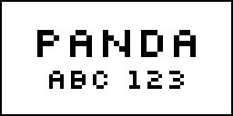 | 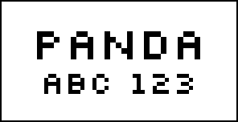 |
| Silkscreen Bold | `Silkscreen-Bold.ttf` | 8 | 48+32 / 56+40 | Bold weight of the above. | 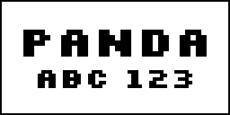 | 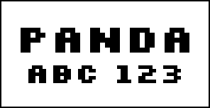 |
| Press Start 2P | `PressStart2P-Regular.ttf` | 8 | 48+32 / 56+40 | Arcade-style, very heavy; the most legible pixel font at a distance but needs a lot of width. | 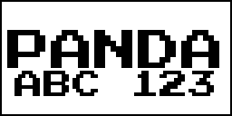 | 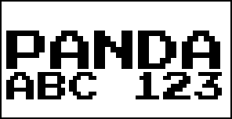 |
| Tiny5 | `Tiny5-Regular.ttf` | 8 | 48+32 / 56+40 | 5 px cap height on an 8 px em; compact, crisp digits. | 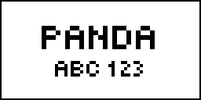 | 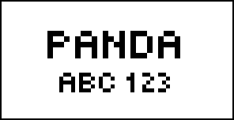 |
| DotGothic16 | `DotGothic16-Regular.ttf` | 16 | 48+32 / 48+32 | Fontworks 16-dot Japanese font; also covers kana and kanji. Light stroke, tall line height. | 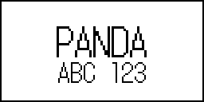 | 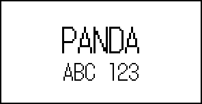 |
| Galmuri11 | `Galmuri11.ttf` | 12 | 48+36 / 48+36 | Korean pixel font, 11 px glyphs on a 12 px line. Full Hangul coverage. | 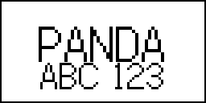 | 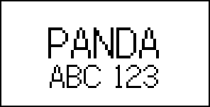 |
| Galmuri11 Bold | `Galmuri11-Bold.ttf` | 12 | 48+36 / 48+36 | Bold weight of the above. | 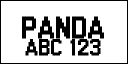 | 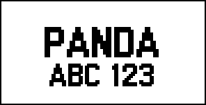 |
| Galmuri14 | `Galmuri14.ttf` | 15 | 45+30 / 45+30 | Larger 14 px Galmuri master on a 15 px line. | 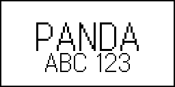 | 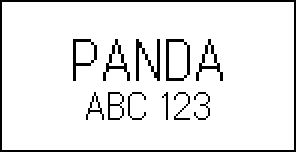 |
| Terminus TTF | `TerminusTTF.ttf` | - | 48+32 / 56+40 | Terminal font with embedded bitmaps at 12, 14, 16, 18, 20, 22, 24, 28 and 32 px. At those sizes the bitmap is used directly; larger sizes use the scaled outline. | 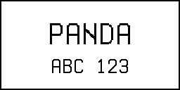 | 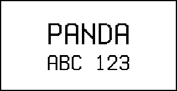 |
| Terminus TTF Bold | `TerminusTTF-Bold.ttf` | - | 48+32 / 56+40 | Bold weight of the above. | 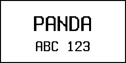 | 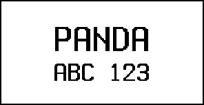 |
| VT323 | `VT323-Regular.ttf` | - | 48+32 / 56+40 | Modelled on the DEC VT320 terminal. Narrow, so long strings fit. | 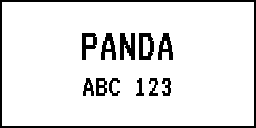 | 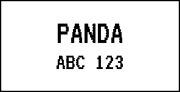 |
| Pixelify Sans | `PixelifySans.ttf` | - | 48+32 / 56+40 | Rounded pixel look with an ordinary sans skeleton. | 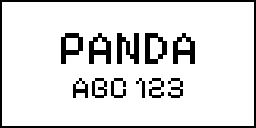 | 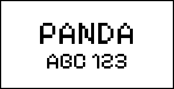 |
| Jersey 10 | `Jersey10-Regular.ttf` | - | 48+32 / 56+40 | Condensed pixel display face; good for large numbers. | 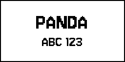 | 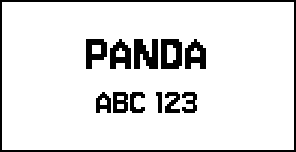 |

### What the previews show

- **Silkscreen, Press Start 2P and Tiny5** at multiples of 8 px are the only samples with no stair-stepping at all. Every stroke is a clean block. The trade-off is a deliberately retro look and, for Press Start 2P, very wide text.
- **Galmuri11** gives the same effect with Hangul support. Its diagonals are made of 4 px steps at size 48, which is inherent to an 11 px design scaled up.
- **B612, Atkinson Hyperlegible and DejaVu Sans** are the cleanest ordinary fonts. Stems are one uniform width and curves are smooth, because their hinting was written for exactly this kind of rendering. Liberation Sans is close behind and is the most space-efficient of the four.
- **Noto Sans KR** and the other Korean fonts are auto-hinted. They look fine at the sizes shown, but thin weights lose pixels on curves and the Ownglyph handwriting face breaks up.
- On the 2.66" canvas everything is slightly larger in pixels, which hides aliasing a little, but the physical pixel density of the two labels is similar so the visual result is close.

### Licenses

All new fonts are redistributable. The license texts are in [optional_fonts/licenses](../optional_fonts/licenses/).

| Fonts | License |
| --- | --- |
| Atkinson Hyperlegible, B612, Silkscreen, Press Start 2P, Tiny5, DotGothic16, VT323, Pixelify Sans, Jersey 10 | SIL Open Font License 1.1 |
| Liberation Sans | SIL Open Font License 1.1 |
| Terminus TTF | SIL Open Font License 1.1 |
| Galmuri | SIL Open Font License 1.1 |
| DejaVu Sans | Bitstream Vera license (free redistribution) |

### Sources

- [Atkinson Hyperlegible, Braille Institute](https://www.brailleinstitute.org/freefont/)
- [B612, the font family for aircraft cockpit screens](https://b612-font.com/)
- [DejaVu fonts](https://dejavu-fonts.github.io/)
- [Liberation fonts](https://github.com/liberationfonts/liberation-fonts)
- [Silkscreen on Google Fonts](https://fonts.google.com/specimen/Silkscreen)
- [Press Start 2P on Google Fonts](https://fonts.google.com/specimen/Press+Start+2P)
- [Tiny5 on Google Fonts](https://fonts.google.com/specimen/Tiny5)
- [DotGothic16 on Google Fonts](https://fonts.google.com/specimen/DotGothic16)
- [VT323 on Google Fonts](https://fonts.google.com/specimen/VT323)
- [Pixelify Sans on Google Fonts](https://fonts.google.com/specimen/Pixelify+Sans)
- [Jersey 10 on Google Fonts](https://fonts.google.com/specimen/Jersey+10)
- [Terminus TTF](https://files.ax86.net/terminus-ttf/)
- [Galmuri, Korean pixel font](https://github.com/quiple/galmuri)
- [Font hinting, Wikipedia](https://en.wikipedia.org/wiki/Font_hinting)
- [Font configuration, ArchWiki](https://wiki.archlinux.org/title/Font_configuration)
